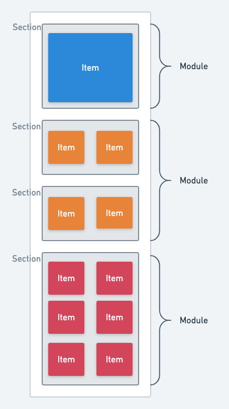

view-impression-sample
===

sample project for **View Impression** log tracking
with CollectionView Compositional Layouts

[WIP] In the future, the core implementation will be improved and made into a library.

<p align="left">
    
</p>

Item > Section > Module
<p align="left">
    
</p>

## About
sample code for slide: [ビューインプレッションの計測方法](https://speakerdeck.com/to4iki/biyuinpuretusiyonfalseji-ce-fang-fa)

## Getting Started
```sh
$ git clone git@github.com:to4iki/view-impression-sample.git
$ cd view-impression-sample
$ open ViewImpressionSample.xcodeproj
```

## Requirements
Requires Swift5.1 and Xcode11 and iOS 13.0 or later.
